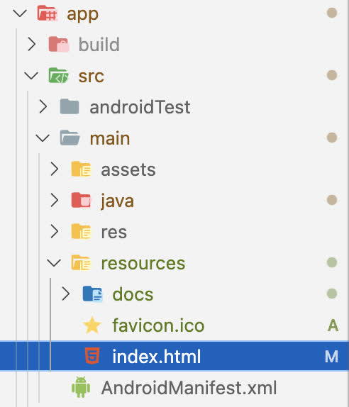
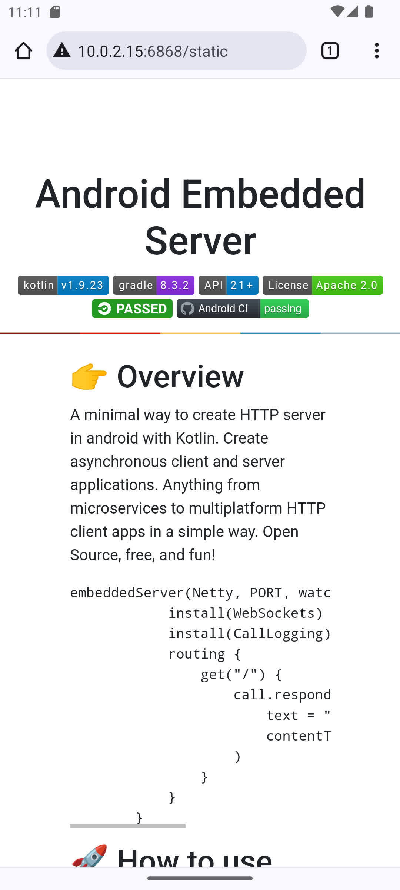
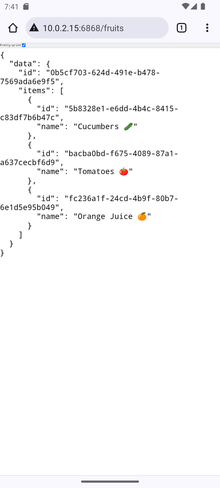
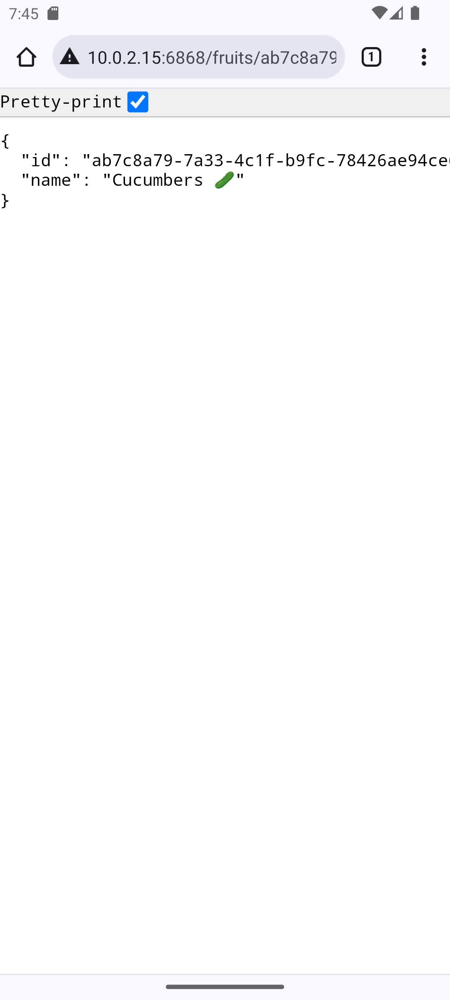
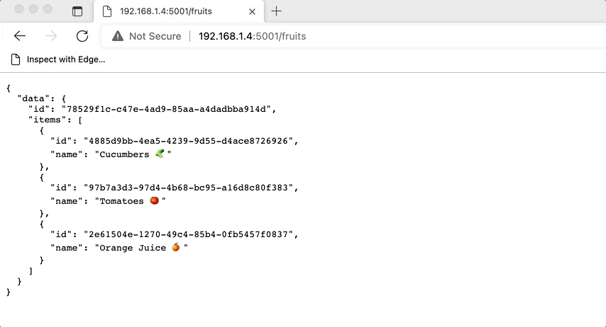

<h1 align="center"> Android Embedded Server </h1>

<div align="center">
    
    
    
    
    
    <a href="https://github.com/nphau/android.embeddedserver/actions/workflows/app-build.yml"></a>
</div>


## 👉 Overview

A minimal way to create HTTP server in android with Kotlin. Create asynchronous client and server applications. Anything from microservices to multiplatform HTTP client apps in a simple way. Open Source, free, and fun!

```kotlin
embeddedServer(Netty, PORT, watchPaths = emptyList()) {
            install(WebSockets)
            install(CallLogging)
            routing {
                get("/") {
                    call.respondText(
                        text = "Hello!! You are here in ${Build.MODEL}",
                        contentType = ContentType.Text.Plain
                    )
                }
            }
        }
```

## 🚀 How to use

Cloning the repository into a local directory and checkout the desired branch:

```
git clone git@github.com:nphausg/android.embeddedserver.git
cd android.embeddedserver
git checkout master
```

## 🍲 Static resource

Config | Demo |
--- | --- |
 |  |

```kotlin
    staticResources("/static", ""){
        default("index.html")
    }
```

## 🍲 Screenshots

<h4 align="center">

Fruits | Detail |
--- | --- |
 |  |

Device | Connect |
--- | --- |
 |  |

## ✨ Contributing

Please feel free to contact me or make a pull request.

<a href="https://revolut.me/nphausg" target="_blank"></a>

<a href="https://github.com/hieuwu" target="_blank">
    
</a>

## 👀 Author

<p>
    <a href="https://nphausg.medium.com" target="_blank">
    
    </a>
</p>
